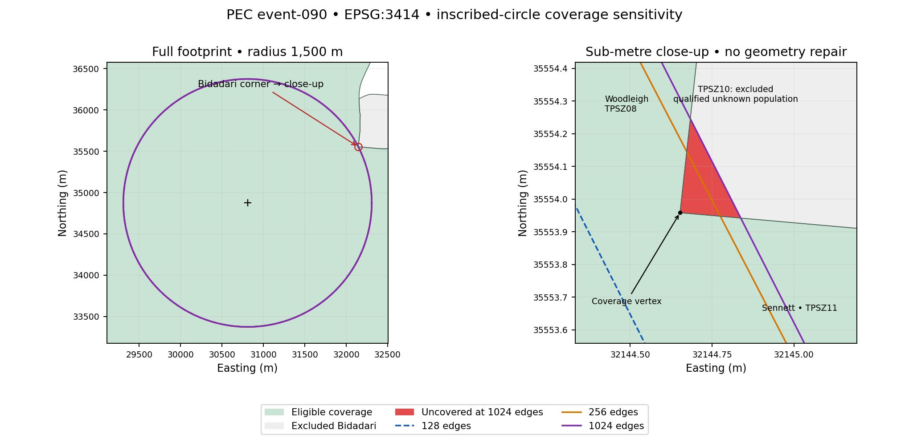

# PEC coverage-status investigation

Investigated 2026-09-15. **The status change is caused by a genuine region outside eligible population coverage revealed by a finer inscribed polygon. It is not explained by floating-point noise or inconsistent area formulas.** No production calculation, tolerance, default-resolution, source-data, eligibility or frontend changes were made.

## Reproduction and identity

The original scenario was recovered exactly from the unchanged `scripts/benchmark_exposure.py` recipe and local dataset, not replaced with a similar scenario. The original benchmark was rerun to a separate file. All four original 128/256 aggregate values at each resolution, the normalized dataset checksum, and the sole changed event match exactly. The original benchmark artifact remains unchanged; a [byte-identical archived copy](pec-coverage-original-benchmark.json) preserves the original measurements for later reproduction.

- Dataset ID: `sg-residents-2020-mp2019`; version: `sg-residents-2020-mp2019-cbb1c395f60918c1`.
- Normalized envelope SHA-256: `4fa83ffefec87ddeb85e77d9b77d41fd8aea6beb9068eaaf926e9e79352054c4`.
- Episode: `pec-benchmark-100`, 100 events; archived [exact recovered input](../../data/scenarios/pec-coverage-benchmark.json). Episode file SHA-256: `f02899a392547bce12eb057ccecb8921d40c0da8632cb2c78b5f17365a9e67fd`.
- Affected event: `event-090`, footprint `footprint-090`; centre **(30807.594901461373, 34874.41074993169) m**, radius **1500 m**, CRS **EPSG:3414**, easting/northing. No event time is supplied.
- Its centre is the representative point of eligible `TPSZ07`, selected at sorted-zone index floor(90 × 275 / 100) = 247. The original radii cycle is 250, 750, 1500, 2500 metres.
- Environment: Python 3.9.6, macOS 26.5.1 ARM64, Shapely 2.0.7, GEOS 3.11.4, pyproj 3.6.1. Figure: Matplotlib 3.9.4, with optional dependencies pinned separately.

The [machine-readable comparison](pec-coverage-comparison.json) contains file checksums for the projected dataset, full display reference, raw boundaries, validation report, provenance, original benchmark and relevant implementation files, plus source provenance checksums, settings, exact numbers, geometric cross-checks and all exclusions. The [timing artifact](pec-coverage-timing.json) is separate from deterministic measurements. Generated filenames in that snapshot are relative to the original `data/results/` output location; the archived episode is linked above.

## Geometry and classification

Known coverage C is the union of eligible projected zones. PEC evaluates `uncovered_area_m2 = area(F \ C)` and returns `partial_coverage` precisely when this exceeds **1e-6 m²** (one square millimetre). There is no relative area tolerance. The positive-area fraction is `area(F ∩ C) / area(F)`; only ratio excursions within `1e-12` of [0,1] may be clamped. Status is calculated from missing area, not from a rounded fraction. Zone-overlap tolerance remains zero.

F is the same polygon for area, intersection, union, coverage, and exposure. `quad_segs = edges / 4`, so 128 edges means 32 segments per quadrant. The first vertex is `(32307.594901461373, 34874.41074993169)`; order is clockwise. The diagnostic checks found exactly the requested edge counts, shared vertices at each doubled resolution from 64 through 1024, and zero area of each coarse polygon outside its successor. Thus higher resolutions add narrow regions between chords and the ideal circle; no rotation or ideal/polygon area mixing occurs.

At the affected boundary, eligible **Woodleigh (`TPSZ08`)** and **Sennett (`TPSZ11`)** meet excluded **Bidadari (`TPSZ10`)**. Bidadari has `population_qualified_nil_or_negligible`, so it contributes neither a count nor known coverage. Its diagnostic projected geometry is valid. It is an excluded-zone corner, not a sliver between mismatched eligible boundaries or the outer extent of the national dataset.

The nearest coverage-boundary vertex is **(32144.651900033845, 35553.958099940886) m**. It lies **1499.835330406692 m** from the centre: **0.164669593308 m inside the ideal circle**, but **0.275762765064 m outside the 128-edge polygon**. It lies inside the 256-edge polygon. At radius 1500 m, maximum chord-to-circle radial deficits are approximately 0.451772 m (128 edges), 0.112947 m (256), and 0.007059 m (1024). These geometric approximation distances have a different meaning and unit from the fixed area tolerance.

At 1024 edges, the missing region is a triangle with vertices:

```text
(32144.83750148568, 35553.94171526044)
(32144.651900033845, 35553.958099940886)
(32144.68334468573, 35554.245646807416)
```

Direct `F ∩ TPSZ10` reproduces `F \ C` areas at 128, 256, 512 and 1024 edges. Subtracting TPSZ10 from the missing region leaves exactly zero area. Nearby eligible intersections contribute zero area to this gap. For attribution only, raw/display boundaries were projected using the existing pipeline CRS/axis settings; all 275 eligible projected geometries matched the prepared WKT coordinates exactly, and display source coordinates matched the checksum-verified raw boundary file. Those diagnostic geometries never replace calculator coverage.

Recentring both coverage and footprint near (0,0) changes uncovered area by at most **6.80e-13 m²** in these cross-checks. The 256-edge missing area, **0.011656080615 m²**, exceeds the classification tolerance by more than 11,656 times. Translation checks are not a formal floating-point error bound, but their agreement, direct excluded-zone intersection, stable positive high-resolution results, and the radial penetration independently support a real supplied-geometry gap. The 128-edge covered fraction of 0.9999999999999999 despite exactly zero difference area is ordinary ratio roundoff; it does not cause the status change.



[Standalone SVG figure](pec-coverage-diagnostic.svg). Green is eligible coverage, grey is excluded Bidadari, red is the 1024-edge missing region; lines show 128, 256 and 1024 edges. Coordinates are metres. The figure is clipped for display only; calculation geometry is unchanged.

## Event convergence

All inputs except resolution are identical. Ideal circle area is **7,068,583.470577034 m²**. Production `CalculationSettings` still permits only 128/256. A private, validated diagnostic settings object calls the same geometry/calculation functions at other resolutions; the 128/256 diagnostic results were also checked against ordinary production settings for exact equality.

The requested whole-episode comparison stops at 1024. Because the tiny missing corner was still growing by 27.5% from 512 to 1024, an **event-only** extension through 16384 quantifies its slower area convergence. The final step changes missing area by 0.000010625019 m² (0.03641%). This is sufficient to establish a stable partial classification; it is not a claim that the area is exact or converged below 1e-6 m².

| Edges | Polygon area (m²) | Ideal area deficit (m²) | Deficit / ideal (%) |
|---:|---:|---:|---:|
| 64 | 7057234.103728360 | 11349.366848674 | 0.160560696 |
| 128 | 7065745.103148191 | 2838.367428843 | 0.040154685 |
| 256 | 7067873.814598745 | 709.655978289 | 0.010039578 |
| 512 | 7068406.052574672 | 177.418002362 | 0.002509951 |
| 1024 | 7068539.115825963 | 44.354751071 | 0.000627491 |
| 2048 | 7068572.381873617 | 11.088703417 | 0.000156873 |
| 4096 | 7068580.698400201 | 2.772176833 | 0.000039218 |
| 8192 | 7068582.777532785 | 0.693044249 | 0.000009805 |
| 16384 | 7068583.297315977 | 0.173261058 | 0.000002451 |

Tolerance is **1e-6 m² at every resolution**. Exposure columns are people potentially exposed. `C` means `complete`, `P` means `partial_coverage`. Runtime is the median of three single-event episode calculations, including one-event aggregation but excluding dataset preparation, file I/O and plotting.

| Edges | Uncovered (m²) | Covered fraction | Status | Known-area exposure | Complete exposure | Runtime (ms) |
|---:|---:|---:|:---:|---:|---:|---:|
| 64 | 0.000000000000 | 1.0000000000000000 | C | 138189.643066976 | 138189.643066976 | 2.780 |
| 128 | 0.000000000000 | 0.9999999999999999 | C | 138322.200835602 | 138322.200835602 | 2.799 |
| 256 | 0.011656080615 | 0.9999999983508352 | P | 138355.165401054 | null | 2.060 |
| 512 | 0.021130191270 | 0.9999999970106139 | P | 138363.416389556 | null | 2.231 |
| 1024 | 0.026942163236 | 0.9999999961884386 | P | 138365.475008448 | null | 2.720 |
| 2048 | 0.028693373057 | 0.9999999959407089 | P | 138365.989780501 | null | 3.535 |
| 4096 | 0.029046269631 | 0.9999999958907918 | P | 138366.118563578 | null | 5.305 |
| 8192 | 0.029181288733 | 0.9999999958716902 | P | 138366.150748926 | null | 8.828 |
| 16384 | 0.029191913751 | 0.9999999958701853 | P | 138366.158795609 | null | 17.720 |

From 128 to 256, polygon area increases **2128.711451 m² (0.0301272%)** and known exposure increases **32.964565 people (0.0238317%)**. Missing area changes from zero to 0.011656080615 m²; its relative increase is undefined and is recorded as null, not a percentage. The complete exposure changes from a number to null, so a numeric difference of complete estimates is also undefined. The machine-readable table includes absolute and relative adjacent-resolution changes wherever the denominator is nonzero.

The 16384-edge result is a numerical reference, not exact analytic circle intersection, a new production policy, or proof of real-world population accuracy. At this reference, missing area is approximately 0.029191914 m²; the classification remains partial.

## Episode convergence is a separate result

The full 100-event episode is **partial_coverage at every tested resolution**. Its complete unique exposure, complete person-exposures and complete multiple-event exposure are **all null** at every row. Values below are known-area subtotals; union missing area is not the sum of missing event areas.

| Edges | Known unique | Known person-exposures | Known multiple | Union uncovered (m²) | Complete / partial events | Runtime (s) |
|---:|---:|---:|---:|---:|:---:|---:|
| 64 | 3390468.973789 | 6599332.082307 | 1850185.548713 | 89334658.990405 | 52 / 48 | 0.138643 |
| 128 | 3391618.301752 | 6606352.867766 | 1852697.710434 | 89468378.605519 | 52 / 48 | 0.161511 |
| 256 | 3391906.001199 | 6608112.877215 | 1853324.461541 | 89501828.213443 | 51 / 49 | 0.204327 |
| 512 | 3391977.868325 | 6608552.946531 | 1853481.356850 | 89510172.854166 | 51 / 49 | 0.300245 |
| 1024 | 3391995.841431 | 6608662.934008 | 1853520.522698 | 89512261.122662 | 51 / 49 | 0.518323 |

The reproduced 128→256 episode changes are **+287.699448 known unique (0.00848266%)**, **+1760.009450 known person-exposures (0.02664117%)**, **+626.751107 known multiple (0.03382911%)**, and **+33449.607924 m² union missing area (0.03738707%)**. Those are aggregate effects of refining all 100 circles; they are not the effect of the one event status flip.

In fact, the entire 0.011656080615 m² newly exposed event-090 gap already lies within other **128-edge** event footprints, to floating-point precision. The episode was already missing coverage there. This independently explains why the event changes status while the episode status does not.

Timing is measured in process with the same prepared dataset. Millisecond event measurements are noisy and need not increase monotonically. Whole-episode 256-edge runtime is approximately 1.27× the 128-edge run here; 1024 is approximately 3.21×. Timings are environment/scenario measurements, not performance guarantees.

## Exclusion audit: all 57 accounted for

The audit checks a one-to-one match between the validation report and display exclusion IDs/reasons, verifies nonempty explicit reasons for every exclusion, and verifies that eligible/excluded IDs are disjoint and together cover all 332 display zones. All **275 eligible + 57 excluded = 332** records are accounted for; no exclusions are added to coverage.

Nonexclusive category counts are **46 qualified unknown population**, **6 invalid geometries**, and **11 participants in 7 positive-area overlap pairs**. Source and projected self-intersection messages describe the same six invalid zones; they are not twelve exclusions. No joins or other reason categories are unaccounted for.

| Disjoint reason combination | Count | Zone IDs |
|---|---:|---|
| invalid geometry | 4 | BDSZ07, BMSZ01, NESZ01, SISZ01 |
| invalid geometry + unknown population | 2 | JESZ10, SISZ02 |
| positive area overlap | 7 | HGSZ08, HGSZ09, SESZ07, SGSZ07, SLSZ01, WCSZ01, YSSZ05 |
| positive area overlap + unknown population | 4 | AMSZ11, PLSZ04, WCSZ02, WCSZ03 |
| unknown population | 40 | BLSZ04, CBSZ01, CCSZ01, DTSZ06, DTSZ07, DTSZ12, HGSZ10, JESZ05, JWSZ05, JWSZ07, MDSZ01, MDSZ02, MESZ01, MPSZ04, MPSZ05, MSSZ01, PGSZ06, PGSZ07, PLSZ03, PLSZ05, PNSZ05, RCSZ04, SBSZ07, SESZ01, SLSZ02, SLSZ03, SMSZ01, SMSZ02, SMSZ03, SMSZ04, SVSZ01, THSZ02, THSZ03, THSZ04, THSZ05, THSZ06, TPSZ10, TSSZ01, WISZ02, WISZ03 |

The disjoint counts sum to **40 + 4 + 7 + 2 + 4 = 57**. Thus 46 + 6 + 11 = 63 is not a distinct-zone count. The [comparison artifact](pec-coverage-comparison.json) preserves all 57 records with original reason strings, names and derived categories; the original [validation report](../../data/processed/validation-report.json) remains authoritative. Overlap testing in preparation excludes invalid geometries, so the absence of an invalid-geometry/overlap combination does not prove invalid shapes could not geometrically overlap.

## Semantics, default and integration conclusion

**Existing behavior matches the documented v0.1 polygon-coverage semantics. No implementation bug was found and no production fix was made.** The coarse polygon genuinely remains inside eligible coverage; the finer polygon genuinely crosses an excluded boundary. However, `complete` at 128 is not proof that the ideal supplied circle has complete coverage. The gap exists in the ideal circle against the supplied coverage too.

**Retain 128 as the reproducible v0.1 default for resolution-labelled approximate exposure; do not use it as a guarantee of ideal-circle coverage.** The unchanged supported 256 option detects this case, improves area approximation and costs about 27% more episode time here. Neither fixed resolution can guarantee all near-boundary status decisions. Increasing the area tolerance to hide this corner would conflate approximation error with geometry-operation noise and is not recommended.

For a future requirement to classify ideal circles conservatively, evaluate a separate boundary-sensitive method, such as inscribed/circumscribed bounds and refinement or an explicit unresolved-boundary state. That changes classification policy/output semantics and needs a separate specification and validation; it is not implemented here. Merely changing the default to 256 would change event-090 from complete to partial and add 32.964565 known-area exposure in this case, but cannot resolve the general boundary problem.

The calculator results are **suitable to begin frontend integration under the existing, resolution-aware contract**, with partial statuses, nullable complete totals and known-area subtotals kept distinct. Do not infer status from a rounded coverage percentage: 0.9999999983508352 may display as 100% while the event is partial. Surface the recorded resolution and interpret completeness as calculation-polygon coverage. This investigation does not verify frontend rendering, end-to-end integration, or ideal-circle completeness; those are not established as ready by these tests.

Remaining uncertainty includes finite-precision GEOS operations, finite circle approximation, sub-metre source-boundary fidelity, historical resident counts, uniform density, qualified unknown populations, and source reconciliation. Bidadari’s null population is preserved. A higher resolution does not improve those source/model limitations or establish real-world hazard validity.

## Tests and exact reproduction commands

Six focused synthetic regressions use a small [triangular-gap fixture](../../tests/fixtures/pec-boundary-gap.json): strictly inside coverage, tangent to a straight boundary, slightly beyond it, a known 0.01 m² internal gap, and an apex lying between a 128-edge chord and its finer polygon. The latter uses an independently interpretable angular midpoint/apothem construction, verifies classification and null totals, and checks translation to Singapore-scale coordinates. It does not freeze unexplained real-data decimals. A settings regression confirms production resolutions and tolerance remain unchanged.

From repository root:

```sh
# Existing PEC environment; plotting dependencies are optional and separate.
.venv/bin/python -m pip install -r scripts/requirements-pec-investigation.txt

# Reproduce the original benchmark without replacing its artifact.
.venv/bin/python scripts/benchmark_exposure.py \
  --output data/results/pec-benchmark-reproduced.json

# Recover original input, compare resolutions, audit exclusions, and draw figure.
.venv/bin/python scripts/investigate_pec_coverage.py

.venv/bin/python -m unittest discover -s tests/unit -p 'test_*.py'
.venv/bin/python -m unittest discover -s tests/integration -p 'test_*.py'

# Optional: ordinary production calculation using the archived exact episode.
.venv/bin/python scripts/population_exposure.py \
  --population data/processed/population-projected.json \
  --episode data/scenarios/pec-coverage-benchmark.json \
  --circle-edges 256 \
  --output data/results/pec-coverage-256.json
```

The diagnostic fails rather than silently substituting data when the original dataset/checksum or benchmark no longer matches. It requires local prepared, display, raw-boundary, provenance and validation files and the original benchmark artifact; it does not acquire sources. If only the ignored `data/results/pec-benchmark.json` is absent, restore it from `docs/specifications/pec-coverage-original-benchmark.json` before running the investigation; that is the archived original, not a replacement run. Do not overwrite an existing benchmark artifact merely to satisfy the check. File checksum assertions verify those inputs and production calculator files remain unchanged. Source reprojection is read-only attribution outside PEC.

Generated results remain ignored under `data/results/`. Versionable report snapshots and figures are kept next to this specification; the exact recovered scenario is under `data/scenarios/`. To refresh the checked-in diagnostic snapshots after a deliberate rerun:

```sh
cp data/results/pec-coverage-comparison.json docs/specifications/pec-coverage-comparison.json
cp data/results/pec-coverage-timing.json docs/specifications/pec-coverage-timing.json
cp data/results/pec-coverage-diagnostic.png docs/specifications/pec-coverage-diagnostic.png
cp data/results/pec-coverage-diagnostic.svg docs/specifications/pec-coverage-diagnostic.svg
cp data/results/pec-coverage-episode.json data/scenarios/pec-coverage-benchmark.json
```

Verification: the full Python suites pass (30 unit tests and 3 integration tests, including existing pipeline and offline real-data checks). The diagnostic figure was rendered and visually inspected. No frontend tests or frontend integration were performed, since no frontend behavior changed.
